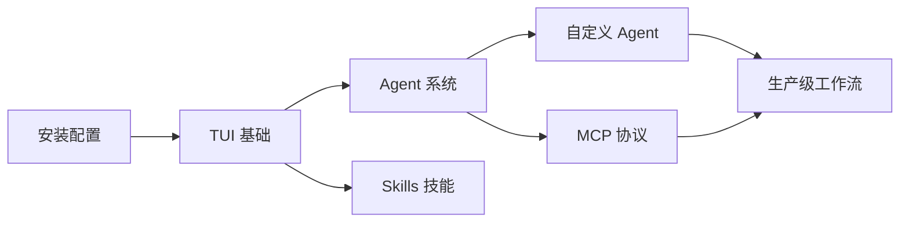

# OpenCode 入门教程

欢迎来到 OpenCode 中文入门教程！本教程将带你从零开始，逐步掌握这款强大的终端 AI 编程助手。

## 什么是 OpenCode？

OpenCode 是一个**开源**的**终端 AI 编程代理**，由 SST 团队开发，在 GitHub 上拥有 120K+ Star。

它类似于 Claude Code、GitHub Copilot CLI，但具有以下独特优势：

- 🆓 **完全开源免费** — 代码托管在 GitHub，可自行审计和修改
- 🔌 **模型无关** — 支持 75+ LLM 提供商（OpenAI、Gemini、DeepSeek、本地模型等）
- 🖥️ **终端原生** — 无需 IDE，直接在终端中使用
- 🤖 **Agent 系统** — 支持自定义 Agent 和 Subagent，构建团队协作流
- 🛠️ **Skills 技能** — 可复用的自动化能力模块
- 🔗 **MCP 协议** — 通过 Model Context Protocol 扩展工具能力
- 📡 **无头模式** — 可作为 HTTP 服务运行，集成到 CI/CD

## 适合谁阅读？

- 想提升命令行效率的开发者
- 对 AI 辅助编程感兴趣的初学者
- 希望定制 AI 编程工作流的团队
- 需要在 CI/CD 中集成 AI 能力的 DevOps 工程师

## 学习路径

### 推荐学习顺序

1. **快速上手**（约 30 分钟）— 安装、配置、跑通第一个会话
2. **核心功能**（约 2 小时）— 掌握 TUI、Agent、Skills、Plan 模式、MCP
3. **进阶玩法**（约 3 小时）— 无头模式、自定义 Agent、上下文工程
4. **参考手册**（按需查阅）— CLI 命令、配置文件、常见问题

## 前置要求

- 基本的命令行操作能力
- 一台能运行终端的电脑（Linux / macOS / Windows）
- 一个 LLM 提供商的 API Key（推荐从 [OpenCode Zen](https://opencode.ai/auth) 开始）

## 开始学习

👉 从 [什么是 OpenCode？](01-getting-started/01-what-is-opencode.md) 开始，或者直接跳到 [安装指南](01-getting-started/02-installation.md)。

---

> 💡 **提示**：本教程持续更新中。如果你发现错误或有改进建议，欢迎提交 Issue 或 PR！
